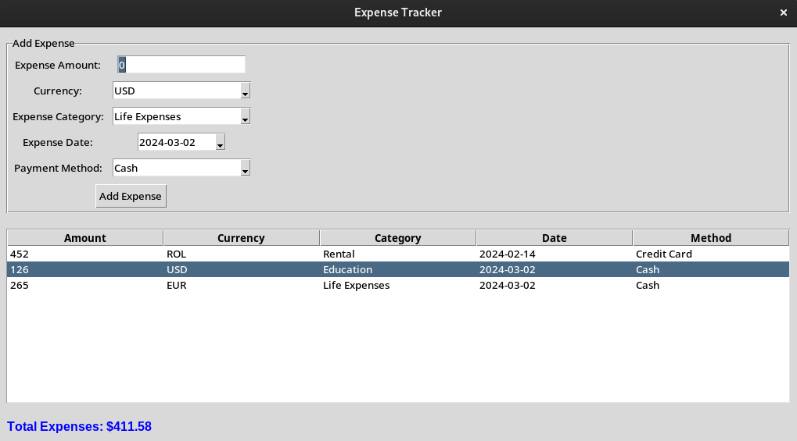

# Expense Tracker

The Expense Tracker is a simple Python application that allows users to track their expenses. It provides a graphical user interface (GUI) for entering expenses, categorizing them, and viewing the total expenses in USD.

## Screenshot



## Features

- Add expenses with details such as amount, currency, category, date, and payment method.
- View expenses in a table format.
- Edit and delete expenses.
- Automatically convert expenses to USD using real-time currency conversion.

## Requirements

- Python 3.6 or higher
- `tkinter` library
- `tkcalendar` library
- `currency_converter` library

## Installation

1. Clone the repository:

```
git clone https://github.com/your_username/expense-tracker.git
```

2. Install the required Python packages:

```
pip install -r requirements.txt
```

## Usage

Run the `expenses_tracker.py` file:

```
python expenses_tracker.py
```

1. Enter the expense details in the input fields.
2. Click the "Add Expense" button to add the expense.
3. Double-click an expense in the table to edit it.
4. Press the Delete key to delete the selected expense.

## Contributing

Contributions are welcome! If you have any suggestions or feature requests, please open an issue or create a pull request.

## License

This project is licensed under the [MIT License](LICENSE).
